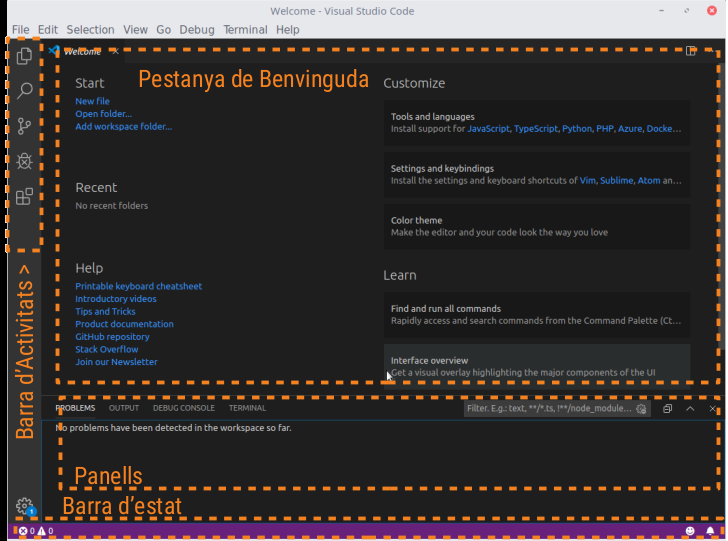
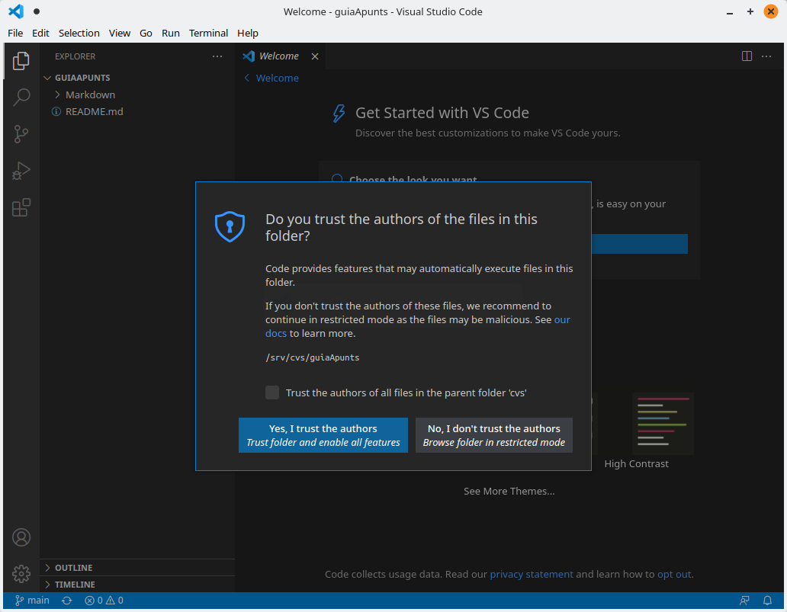
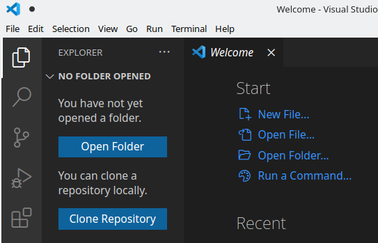
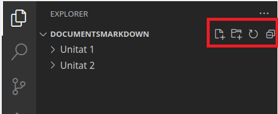
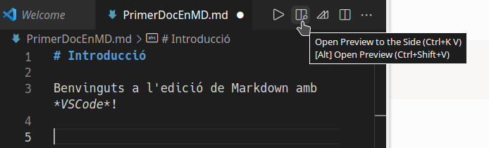
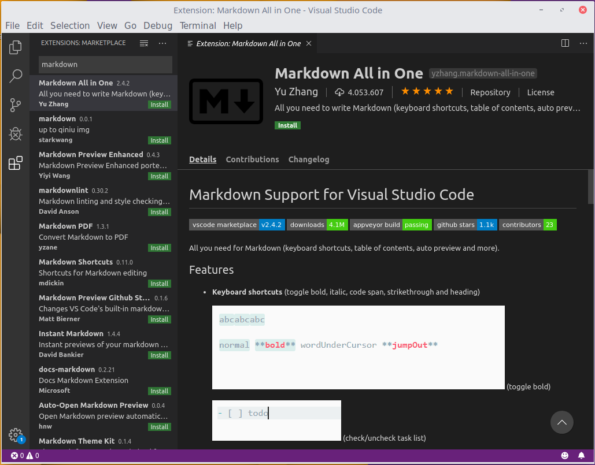

# Edició d'Arxius Markdown

Markdown és un format d'arxiu de text senzill, per la qual cosa qualsevol editor bàsic de text és suficient per a treballar amb ell. No obstant això, existeixen ferramentes especialitzades per a l'edició d'aquest tipo d'arxius, tant en entorns d'escriptori com en aplicacions web.

A continuació, et presentem algunes d'elles, encara que hi ha moltes més:

* **Editors en línia:**

    + Dillinger: [https://dillinger.io/](https://dillinger.io/)
    + Stackedit: [https://stackedit.io/](https://stackedit.io/)

* **Editors d'Escriptori:**

    + Typora: [https://typora.io/](https://typora.io/)
    + WriteMonkey: [https://writemonkey.com/](https://writemonkey.com/)
    + Haroopad: [http://pad.haroopress.com/](http://pad.haroopress.com/)

La majoria d'aquestes ferramentes compten amb una interfície dividida en dues parts: en una s'escriu el contingut en format Markdown i en l'altra es mostra una vista prèvia en temps real. **Typora**, en particular, es diferencia per oferir una experiència tipus WYSIWYG, ja que renderitza automàticament el text mentre l'escrius.

## 1. Visual Studio Code (VS Code)

En aquest document ens centrarem en **Visual Studio Code (VSCode)**, un editor desenvolupat per Microsoft. Encara que està dissenyat principalment per a treballar amb codi font de programes, suporta Markdown de manera nativa i permet previsualizar els documents.

Característiques principals de VS Code:

* **Lleuger i multiplataforma:** Funciona en Windows, macOS i Linux.
* **Interfície neta:** Ofereix una experiència d'usuari senzilla i personalitzable.
* **Paleta de comandos:** Permet accedir ràpidament a funcionalitats mitjançant dreceres de teclat.
* **Terminal integrada:** Inclou una terminal que facilita el treball en projectes complexos.
* **Suport de control de versions:** Compatible amb sistemes com Git.
* **Extensions:** Permet ampliar la seua funcionalitat mitjançant plugins.

### 1.1. Extensió Markdown All In One

Una de les extensions més útils per a treballar amb Markdown en VS Code és **Markdown All In One**.

Aquesta extensió afegeix funcions com:

* Dreceres de teclat per a treballar més ràpid.
* Generació automàtica de taules de continguts.
* Diverses utilitats que milloren l'experiència amb Markdown.

### 1.2. Instal·lació de Visual Studio Code

La instal·lació més senzilla de VS Code és descarregar-ho des del seu lloc oficial: [https://code.visualstudio.com/download](https://code.visualstudio.com/download).

Per a més informació sobre el procés d'instal·lació en sistemes Linux i Windows, pots consultar la documentació oficial de l'editor:

* [Instal·lació en Linux](https://code.visualstudio.com/docs/setup/linux)
* [Instal·lació en Windows](https://code.visualstudio.com/docs/setup/windows)

## 2. Primers Passos amb VS Code

Una vegada instal·lat, pots accedir a **Visual Studio Code** des del menú principal del teu sistema, en la categoria de Programació.

En obrir-ho per primera vegada, se't demanarà que tries entre un tema clar o un fosc per a personalitzar l'aparença de l'editor. Pots seleccionar qualsevol d'ells segons les teves preferències.

La interfície principal de VS Code es veu aproximadament així:

### 2.1. Elements principals de la interfície:

* **Barra d'activitats:** Situada a l'esquerra, conté cinc activitats principals:

    + **Explorador d'arxius:** Per a gestionar els teus projectes i arxius.
    + **Cerca de text:** Eina per a buscar contingut dins del projecte.
    + **Control de versions:** Suport integrat per a Git.
    + **Depuració:** Permet executar i depurar codi.
    + **Extensions:** Gestiona i afegeix funcionalitats addicionals a l'editor.

* **La finestra de benvinguda:** La finestra de benvinguda ocupa la part superior de l'editor i ofereix opcions inicials com crear un arxiu nou, obrir una carpeta o afegir un espai de treball.

* **Panells addicionals:** baix de la finestra principal trobaràs diversos panells que mostren informació sobre la depuració, errors i advertiments o la terminal integrada de VS Code.
* **Barra d'estat:** en la part inferior de l'editor està la barra d'estat, que mostra informació sobre el projecte i els arxius oberts.
En versions recents, en obrir una carpeta nova, l'editor pot demanar que confirmis si confies en la font del codi dins d'aquesta carpeta.

Per a més detalls sobre la interfície de VS Code, pots consultar:

* [Documentació de la Interfície d'Usuari](https://code.visualstudio.com/docs/getstarted/userinterface)

## 3. Treballant amb VS Code i Markdown

Amb VS Code pots editar arxius directament, però el més útil és obrir una carpeta completa per a treballar amb tots els arxius que conté.

1. Fes clic en el botó **Open Folder** de l'explorador d'arxius.
2. Selecciona una carpeta. Per exemple, una anomenada `DocumentsMarkdown`.

L'estructura de la carpeta es mostrarà com un arbre en l'explorador d'arxius, amb totes les carpetes i arxius dins. Per exemple, podries veure una carpeta principal amb subcarpetas com a `Unitat 1` i `Unitat 2`.

Al costat del nom de la carpeta principal, trobaràs quatre icones:

1. **Crear document nou:** Agrega un arxiu en la carpeta seleccionada.
2. **Crear carpeta nova:** Agrega una subcarpeta.
3. **Refrescar vista:** Actualitza el contingut de l'explorador.
4. **Contreure arbre:** Mostra només els elements del nivell principal.

### 3.1. Crear un document nou

1. Fes clic en la primera icona per a crear un document.
2. Introdueix un nom per a l'arxiu. Recorda usar l'extensió `.md` perquè siga reconegut com un arxiu Markdown.

**Nota important:** Encara que els arxius Markdown són de text, utilitzar l'extensió `.md` assegura que les aplicacions els reconeguen correctament. En VS Code, aquests arxius apareixeran amb una icona específica.

### 3.2. Editar i previsualizar un arxiu Markdown

Una vegada creat un arxiu, pots començar a escriure directament. En la part superior dreta de la finestra de l'editor, veuràs diverses icones. Un d'ells és un rectangle dividit amb una lupa. Aquesta icona permet activar la vista dividida per a:

* Mostrar el text que escrius en la part esquerra.
* Veure una previsualització en temps real en la part dreta.

Per a tancar la vista prèvia, fes clic en la **x** al costat del nom de l'arxiu en la previsualització.

## 4. Instal·lació de plugins en VS Code

VS Code és lleuger però extremadament flexible gràcies a les extensions.

### 4.1. Com instal·lar extensions

1. Fes clic en l'activitat de **Extensions** en la barra d'activitats.
2. Usa el quadre de cerca per a buscar, per exemple, Markdown.
Apareixeran diverses extensions relacionades. Encara que no és obligatori instal·lar extensions per a treballar amb Markdown, algunes com **Markdown All In One** ofereixen funcions addicionals interessants.

Per a instal·lar una extensió:

* Fes clic en el botó **Install** que apareix al costat de la descripció de l'extensió.

Explora aquestes ferramentess i trau el màxim partit a VS Code treballant amb Markdown.