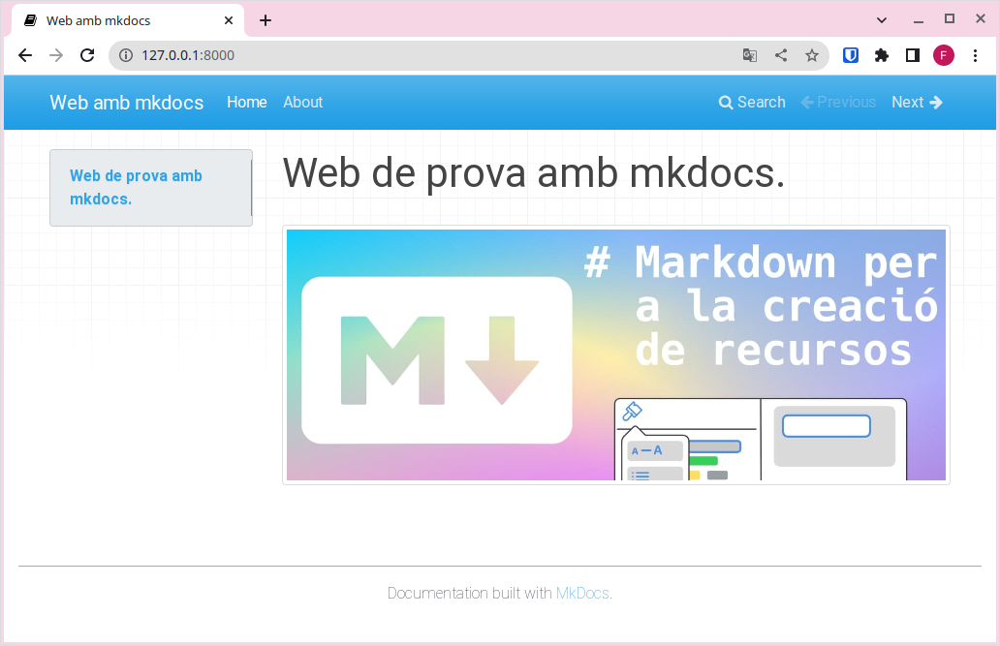
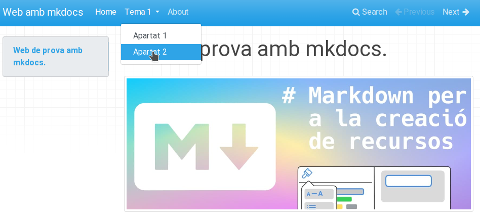
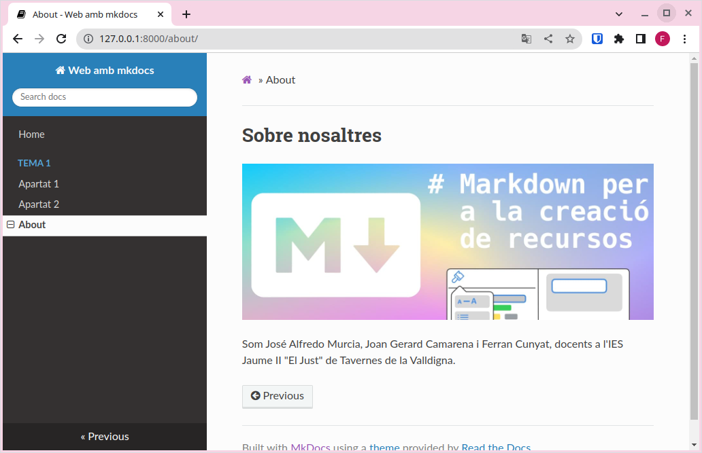
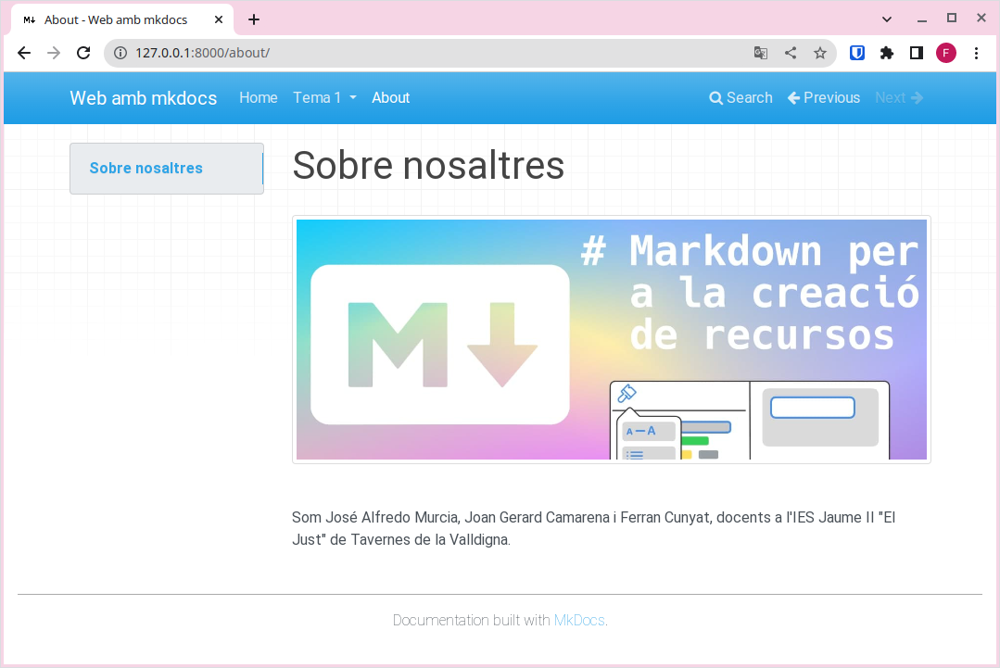
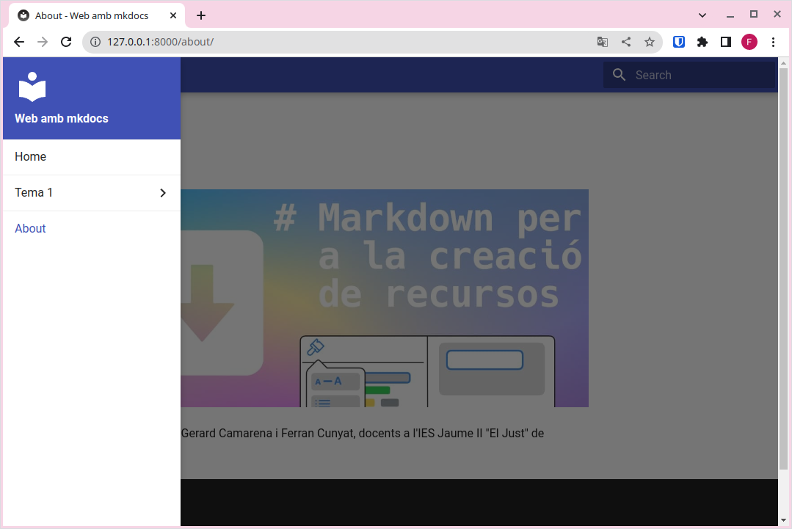
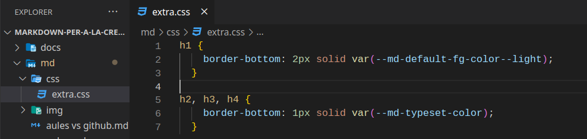
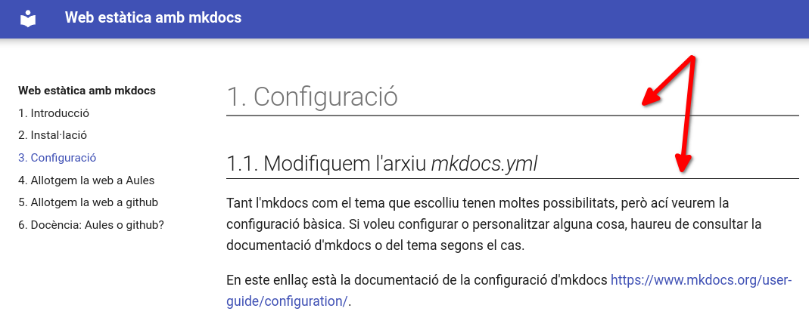
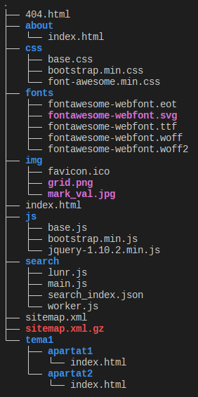

# Configuració

## 1. Modifiquem l'arxiu mkdocs.yml

Tant MkDocs com el tema que triïs ofereixen moltes opcions de configuració, però ací veurem la configuració bàsica. Si vols personalitzar alguna cosa més, hauràs de consultar la documentació de MkDocs o la del tema que estiguis usant.

Pots trobar la documentació sobre la configuració de MkDocs en el següent enllaç: [https://www.mkdocs.org/user-guide/configuration/](https://www.mkdocs.org/user-guide/configuration/).

### 1.1. site_name

L'única configuració estrictament necessària per a servir la web és site_name, que serà una cadena de text que defineix el títol de la pestanya del navegador i apareixerà en el menú de navegació. És a dir, és el nom que identifica el teu lloc web, així que serà la primera configuració que modifiquem.

Per exemple, en el cas d'aquesta web, hem utilitzat site_name: P2-P3 - Projecte Intermodular.

### 1.2. docs_dir

Amb la directiva docs_dir, indiquem en quina carpeta es troben els arxius font (el contingut escrit en Markdown) a partir dels quals es generarà la web.

!!! note "docs_dir"
    De moment podem deixar docs_dir sense configurar, encara que necessitarem modificar-ho en apartats posteriors.

### 1.3. site_dir

Amb la directiva site_dir, indiquem en quina carpeta volem que es genere la versió compilada de la web per a publicar.

!!! note "site_dir"
    De moment podem deixar site_dir sense configurar, però serà necessari en apartats posteriors.

## 2. Pàgines

En aquesta secció veurem com configurar noves pàgines per al teu lloc web. Aquestes seran accessibles a través del menú de navegació.

El primer pas consisteix a crear un nou arxiu amb extensió .md (per exemple, about.md) i guardar-ho en la carpeta docs.

Després, modificarem l'arxiu de configuració per a afegir al menú de navegació les nostres pàgines de la manera següent:

```markdown title="YAML" linenums="1"
nav:
    - Home: index.md
    - About: about.md
```

Ara la pàgina tindrà el següent aspecte:



Com pots veure, en el menú de navegació apareixen les opcions Home i About, i també es mostren fletxes de Previous i Next per a desplaçar-nos entre pàgines.

Per a crear submenús en el menú de navegació, podem configurar l'arxiu mkdocs.yml així:

```markdown title="YAML" linenums="1"
nav:
    - Home: index.md
    - Tema 1:
        - Apartat 1: tema1/apartat1.md
        - Apartat 2: tema1/apartat2.md
    - About: about.md
```



## 3. Cercador

Observa que també disposem d'un cercador en el menú de navegació, que ens permetrà realitzar cerques en tot el contingut del lloc web.

!!! note "Cercador"
    Això pot ser molt útil per al teu lectors, ja que així podran utilitzar els teus materials com a documentació de referència i trobar de manera ràpida el contingut que els interesse.

    El motor de cerca localitzarà totes les aparicions de la paraula que s'introduixca en el cercador.

## 4. Tema

Fins ara, hem utilitzat el tema per defecte per a renderitzar la pàgina, però existeixen altres temes per a canviar la seva aparença sense tocar el contingut en Markdown.

Per a canviar de tema, edita l'arxiu de configuració (mkdocs.yml) i afegeix una línia com la següent:

```markdown title="YAML" linenums="1"
theme: readthedocs
```

En desar l'arxiu, veuràs que l'aparença del lloc canvia:


*<center> Tema readthedocs </center>*


*<center>Tema mkdocs</center>*


*<center>Tema material</center>*

!!! note "Temes per defecte"
    MkDocs només inclou de sèrie dos temes (mkdocs i readthedocs). No obstant això, existeixen altres desenvolupats per tercers. En general, instal·lar-los i configurar-los és un procés molt senzill, encara que hauràs de consultar la documentació de cada tema.

    En aquest enllaç trobaràs més informació sobre altres temes per a MkDocs: [https://github.com/mkdocs/mkdocs/wiki/mkdocs-themes](https://github.com/mkdocs/mkdocs/wiki/mkdocs-themes).

!!! note "Material for MkDocs"
    Un dels temes més complets, amigables i versàtils és Material for MkDocs. Pots consultar la seva documentació si vols usar-ho.

    Per a instal·lar-ho, executa: `pip install mkdocs-material`.

    Per a utilitzar-ho, afegeix a l'arxiu de configuració: `theme: material`.

    [https://squidfunk.github.io/mkdocs-material/](https://squidfunk.github.io/mkdocs-material/)

### 4.1. Modifiquem el tema

Si vols modificar alguns detalls del tema, pots crear un arxiu amb les teves pròpies regles CSS i col·locar-lo en la carpeta on tingues els arxius font (la que indiques en docs_dir). Després, en l'arxiu mkdocs.yml, ho referencies amb l'opció `extra.css`.

Per exemple:



Arxiu mkdocs.yml (fragment):

```markdown title="YAML" linenums="1"
docs_dir: "md"
site_dir: "docs"

...

extra_css:
- css/extra.css
```

En construir el projecte (*build*), comprovaràs que els arxius CSS personalitzats es copien en la carpeta indicada en site_dir i que els canvis s'apliquen en servir el lloc de manera local.



## 5. Canviar la icona de la web

Per defecte, MkDocs utilitza la seva pròpia icona. Si vols utilitzar un diferent, crea un directori img en la carpeta docs i guarda ací un arxiu anomenat favicon.ico. MkDocs ho detectarà automàticament i reemplaçarà la icona per defecte.

## 6. Afegir admonitions (caixes a l'estil “awesomebox”)

Per a ressaltar contingut amb caixes de colors (admonitions), cal afegir el següent plugin en l'arxiu de configuració:

```markdown title="YAML" linenums="1"
markdown_extensions:
    - admonition
```

A diferència de “awesomebox”, les caixes de MkDocs es defineixen amb tres signes d'exclamació (!!!) i el contingut dins de la caixa va tabulat. Per exemple:

```markdown title="Markdown" linenums="1"
!!!noti "Anotació"
    Aquesta part sí que la podeu provar a casa.

!!!warning "Warning!"
    Ves amb compte en realitzar aquesta part.

!!!danger "Perill!"
    No proveu això a casa.
```

!!! noti "Anotació"
    Aquesta part sí que la podeu provar a casa.

!!! warning "Warning!"
    Ves amb compte en realitzar aquesta part.

!!! danger "Perill!"
    No proveu això a casa.

## 7. Construir el lloc web

Finalment, després d'haver comprovat en el nostre ordinador que el resultat és l'esperat, construïm el lloc web (deixant-lo preparat per a publicar-ho en un servidor) mitjançant el comando:

```markdown title="Bash" linenums="1"
mkdocs build
```

Veuràs que es crea una carpeta site amb la següent estructura:



Aquesta carpeta conté tots els arxius necessaris per a servir el lloc web. És la carpeta que s'ha de pujar a qualsevol servidor perquè siga accessible a través d'Internet.

## 8. Resum

1. Instal·lem MkDocs.
2. Creem un nou projecte amb `mkdocs new "nom_de el_projecte"`.
3. Servim el lloc de manera local i comprovem que tot funciona i es veu com volem amb `mkdocs serve`.
4. Afegim el contingut en arxius.md en la carpeta docs.
5. Enllacem els arxius al menú de navegació modificant l'arxiu mkdocs.yml.
6. Configurem el tema, el nom del lloc i la resta d'opcions que vulguem utilitzar.
7. Construïm el lloc amb `mkdocs build`.

D'aquesta manera, disposarem d'un lloc estàtic llest per a ser publicat en qualsevol servidor.