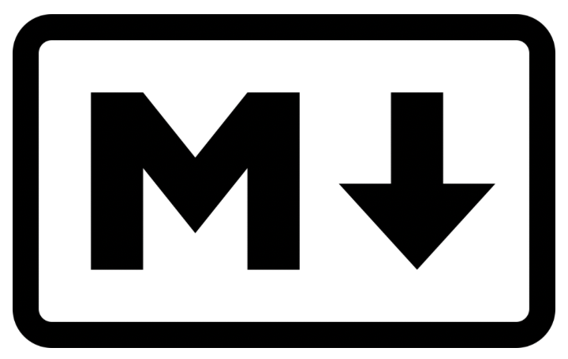

# Documentació d'aplicacions amb MarkDown

En aquest tema explorarem com utilitzar **Markdown** per crear documentació clara, estructurada i professional per als teus projectes de desenvolupament.

Markdown es un llenguage de marques lleuger i sencill que permet generar documents atractius amb una sintaxis mínima. Aprendràs des de conceptes bàsics fins a funcionalitats avançades, així com les millors pràctiques per a integrar-lo als teus projectes i ferramentes.

La documentació efectiva no sols millora la comunicació dins dels equips, si no que també facil·lita la comprensió i el manteniment del software al llarg del temps.